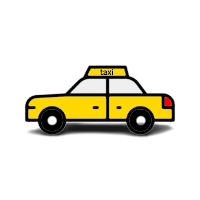

# Taxi Service

Welcome to the **Taxi Service** project! This project is designed to simulate a taxi service system where users can register as drivers, book rides, and manage their accounts.

## Features

1. Driver Management:
    - Drivers can register in the system by providing their personal details.
    - Registered drivers can log in and manage their profiles.
    - Drivers can view the list of cars, assigned to them, and update their information.

2. Authentication and Authorization:
    - Access to certain functionalities is restricted to authenticated users.
    - Users need to log in to access features.
    - Authorization checks are performed to ensure that users can access their own data.

## Technologies Used

- Java: The main programming language used for the project.
- Servlets: Used for handling HTTP requests and responses.
- JSP (JavaServer Pages): Used for rendering dynamic web content.
- JDBC (Java Database Connectivity): Used for interacting with the database.
- MySQL: The database management system used to store user and ride data.
- Maven: Used for project management and dependency resolution.
- Tomcat: The web server used to deploy and run the application.

## Setup and Installation

1. **Clone the repository**:

2. **Set up the database**:
   - Install MySQL and create a new database.
   - Modify the database connection properties in the `src/main/resources/db.properties` file to match your database configuration.

3. **Configure Database Connection**:
   - Open the project in your Integrated Development Environment (IDE).
   - Update the `ConnectionUtil` class in the project, which contains the database connection settings:
      - `url`: The URL of your MySQL database.
      - `username`: The username for accessing your MySQL database ('root' by default).
      - `password`: The password for accessing your MySQL database.
      - `JDBC driver`: Ensure that you have the appropriate JDBC driver for MySQL configured in your project.

4. **Download Apache Tomcat**:
   - Download Apache Tomcat version 9.x.x from the official Apache Tomcat website: [https://tomcat.apache.org/download-90.cgi](https://tomcat.apache.org/download-90.cgi).
   - Choose the appropriate installation package for your operating system.

5. **Deploy the application**:
   - Edit Tomcat configuration in 'Select Run/Debug Configuration' window in your IDE.
   - Add configuration 'Tomcat -> Local'.
   - Chose 'Fix' button and  select 'taxi-service:war exploded' option. You can change Application context to just `/`.
   - Start the Tomcat server.

6. **Access the application**:
   - Open a web browser and go to `http://localhost:8080/` to access the application.

## Project Structure

Below is the project structure that provides a detailed description of each level and its purpose.

`src/main/java`: Contains the Java source code.

- `/src/main/java/taxi/controller`: This level contains the controller classes that handle HTTP requests and interact with the user. Controllers receive input data, perform necessary business logic, and return a response to the client.

- `/src/main/java/taxi/dao`: The DAO (Data Access Object) level is responsible for data access to the database or other data sources. Classes in this level provide create, retrieve, update, and delete operations for objects in the database.

- `/src/main/java/taxi/exception`: This level includes exception classes used for handling exceptional situations in your application. This helps make the code more readable and ensures proper error handling.

- `/src/main/java/taxi/lib`: The `lib` level contains additional utilities, libraries, and other auxiliary classes that can be used in the project.

- `/src/main/java/taxi/model`: This level houses the model classes that represent objects used in your application. These classes may include fields, data access methods, and other methods required for working with these objects.

- `/src/main/java/taxi/service`: The service level contains the business logic of your application. Services perform operations on models, access the database through DAOs, and implement business rules and processes.

- `/src/main/java/taxi/util`: This level contains utility classes that provide helper functions and methods that can be used throughout the project.

- `/src/main/java/taxi/web.filter`: The filter level contains filter classes that allow intercepting and modifying HTTP requests and responses before they reach the controllers or after they leave the controllers. Filters can be used for authentication, authorization, error handling, and other tasks.

`src/main/resources`: Contains configuration files and resources.

`src/main/webapp`: Contains the web application resources, including JSP files and CSS files.

## Making Changes

When making changes to the project, it is recommended to adhere to this structure and place the corresponding classes in their respective levels. This ensures organization and ease of understanding the project.

## Contributors

- [Mykyta Naumov](https://github.com/MykNich)

